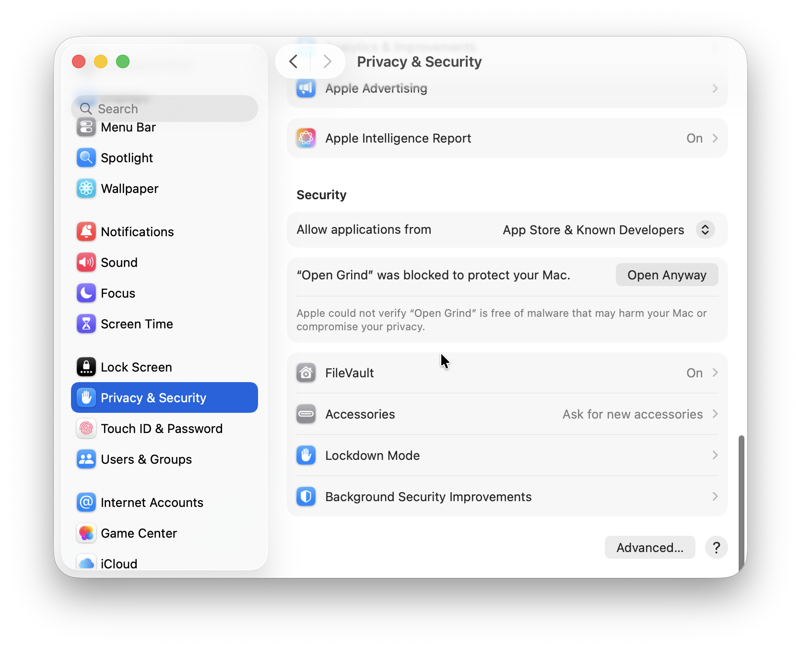

<script setup>
    import { VPButton } from 'vitepress/theme';
</script>

# Download Open Grind

Never download Open Grind from unofficial sources. The only official source of Open Grind releases is https://git.opengrind.org/open-grind/open-grind/releases. All releases are signed and reproducible.

> [!Warning] 🚧&nbsp;&nbsp;Open Grind is in active development.&nbsp;&nbsp;🚧
> [Contribute to the project](https://git.opengrind.org/open-grind/open-grind/) or [join the discussion](https://matrix.to/#/#opengrind:opengrind.org) to help us prioritize features and improvements.

## Android

<div class="vpbuttons-row">
    <VPButton href="https://git.opengrind.org/open-grind/open-grind/releases/download/v0.1.0-beta.4/open-grind-v0.1.0-beta.4-android.apk" size="medium">Download for Android (apk)</VPButton>
</div>

Install using your system's APK installer. Optionally, enable auto updates.

## Windows

<div class="vpbuttons-row">
    <VPButton href="https://git.opengrind.org/open-grind/open-grind/releases/download/v0.1.0-beta.4/open-grind-v0.1.0-beta.4-windows-x86_64.exe" size="medium">Download for Windows x86_64</VPButton>
    <VPButton href="https://git.opengrind.org/open-grind/open-grind/releases/download/v0.1.0-beta.4/open-grind-v0.1.0-beta.4-windows-arm64.exe" size="medium">Download for Windows arm64</VPButton>
</div>

Launch the installer and follow the steps. Optionally, enable auto updates. To uninstall, use the bundled uninstall.exe. Check "delete app data" to delete the session and preferences.

## Linux

<div class="vpbuttons-row">
    <VPButton href="https://git.opengrind.org/open-grind/open-grind/releases/download/v0.1.0-beta.4/open-grind-v0.1.0-beta.4-linux-x86_64.deb" size="medium">Download for Debian/Ubuntu x86_64 (deb)</VPButton>
    <VPButton href="https://git.opengrind.org/open-grind/open-grind/releases/download/v0.1.0-beta.4/open-grind-v0.1.0-beta.4-linux-arm64.deb" size="medium">Download for Debian/Ubuntu arm64 (deb)</VPButton>
</div>

The deb files are only supported by Debian-based distros (Ubuntu, Linux Mint, etc). For other Linux distributions, please [build manually](https://git.opengrind.org/open-grind/open-grind/src/branch/main/BUILDING.md). Open Grind currently does not ship AppImage because of reproducibility issues.

Linux releases do not have in-app auto-updater. To uninstall, manually clear all secrets from your Secret Service, then run `apt purge`.

### Track updates with apt

Debian, Ubuntu and derivatives can install Open Grind from the project's own repository, so `apt` handles updates:

```sh
sudo install -d -m 0755 /etc/apt/keyrings
curl -fsSL https://git.opengrind.org/api/packages/open-grind/debian/repository.key \
	| sudo tee /etc/apt/keyrings/opengrind.asc > /dev/null
sudo tee /etc/apt/sources.list.d/opengrind.sources > /dev/null <<'EOF'
Types: deb
URIs: https://git.opengrind.org/api/packages/open-grind/debian
Suites: stable
Components: main
Signed-By: /etc/apt/keyrings/opengrind.asc
EOF
sudo apt update && sudo apt install open-grind
```

Use `Suites: beta` to track prereleases. To remove the repository, delete both files.

> [!Note] Trust
> The repository index is signed by a key held on the server. The release artifacts and their `.minisig` signatures stay the canonical, reproducible download — the repository only exists so updates arrive through your package manager.

## macOS

<div class="vpbuttons-row">
    <VPButton href="https://git.opengrind.org/open-grind/open-grind/releases/download/v0.1.0-beta.4/open-grind-v0.1.0-beta.4-macos.zip" size="medium">Download for macOS (universal)</VPButton>
</div>

Extract Open&nbsp;Grind.app from zip archive and move to Applications folder. To uninstall, move the app from Applications to Trash.

::: info If you get "Apple could not verify “Open Grind” is free of malware that may harm your Mac or compromise your privacy.",

1. Open System Settings
2. Go to "Privacy & Security"
3. Scroll to "“Open Grind” was blocked to protect your Mac."



4. Click "Open Anyway"
5. In the "Open “Open Grind”?" dialog click "Open Anyway"
6. Enter administrator password or Touch ID
:::


## iOS

**iOS is currently not supported.** Open Grind iOS builds are likely to be released in Fall 2026 with the upcoming publishing in the third party app stores.

